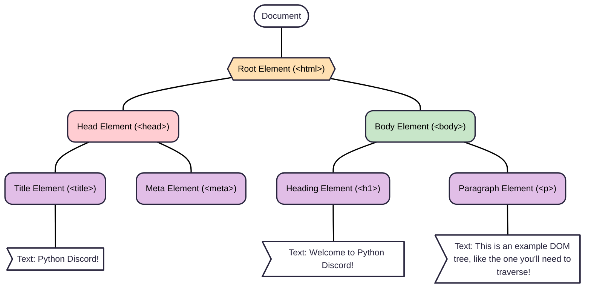

# 2025 Code Jam 12 Qualifier
To qualify for the upcoming Code Jam, you'll have to complete a qualifier assignment. The goal is to make sure you have enough Python knowledge to effectively contribute to a team.

Please read the rules and instructions carefully, and submit your solution before the deadline using the [sign-up form](https://forms.pythondiscord.com/form/cj12-2025-qualifier).

# Table of Contents
- [Qualifying for the Code Jam](#qualifying-for-the-code-jam)
- [Rules and Guidelines](#rules-and-guidelines)
- [The Qualifier: Parssssel Tounge Page Parssssser](#parssssel-tongue-page-parssssser)
    - [Background](#background)
        - [What is a query selector?](#what-is-a-query-selector)
    - [The Task](#the-task)
        - [Query Selectors to Implement](#query-selectors-to-implement)
        - [Examples](#examples)
        - [What you are **NOT** expected to implement](#what-you-are-not-expected-to-implement)
        - [The `Node` Class](#the-node-class)
    - [Bonus Task](#bonus-task)

# Qualifying for the Code Jam
To qualify for the Code Jam you will be required to upload your submission to the [sign-up form](https://forms.pythondiscord.com/form/cj12-2025-qualifier). We set up our test suite so you don't have to worry about setting one up yourself.

Your code will be tested with a multitude of tests to test all aspects of your code making sure it works.

> [!CAUTION]
Do not commit any code to a public place until the Qualifier is closed.
> 
> 
> The qualifier is an individual challenge to assess fundamental python skills. To the end
> we do not want folks to use solutions they did not come about on their own.
> 
> In that same vein, we ask that folks do not use any AI or LLM tools for the qualifier.
> 

# Rules and Guidelines
- Your submission will be tested using a **Python 3.13 interpreter** with only stdlib packages available. You are not allowed to use external packages to complete this assignment. Please make sure to include the relevant `import` statements in your submission.

- Use [`qualifier.py`](qualifier/qualifier.py) as the base for your solution. It includes stubs for the functions you need to write. It also includes extra classes available for your use if needed. Be sure to leave them in your solution when you submit.

- Do not change the **signatures** of the classes and functions you are challenged to finish, included in [`qualifier.py`](qualifier/qualifier.py). The test suite we will use to judge your submission relies on them. Everything else, including the docstring, may be changed.

- Do not include "debug" code in your submission. You should remove all debug prints and other debug statements before you submit your solution.

- This qualifier task is supposed to be **an individual challenge**. You should not discuss (parts of) your solution in public (including our server), or rely on others' solutions to the qualifier. Failure to meet this requirement may result in the **disqualification** of all parties involved. You are still allowed to do research and ask questions about Python as they relate to your qualifier solution, but try to use general examples if you post code along with your questions.

- Do not post or commit your code to any place public, including if you fork this repository. Do not push your code until the qualifier has closed.

- Due to the nature of this task and its goal to assess an individual's skill, we also ask and require that you do not use any LLM or AI assistance for this.

- You can run the tests locally by running the `unittest` suite with `python -m unittest tests.py` or `py -m unittest tests.py` from within the `./qualifier` directory.

# Parssssel Tongue Page Parssssser

In recent years, snakes have increasingly taken to the internet, and writing blog posts is becoming an increasingly common passstime for them. Our research inside Python Discord Labs has realized we need to advance the snake blog technology area. We're undertaking the creation of a blog searching tool to understand the website pages that the snake community are putting out.

We're enlisting you to help build part of this new technology. We'll explain more below!


<!-- toc -->


## Background

HTML is used to define the structure of a web page, and it’s often useful to be able to navigate that structure.

For example, given the following HTML from a snake’s blogpost:

```html
<html>
  <head>
    <title>My Day in the Ssskatepark</title>
    <meta ...>
  </head>
  <body>
    <h1>I Went to the Ssskatepark today</h1>
    <p>I practiced some tricksss and ended up competing with a rattlessssnake.</p>
  </body>
</html>

```

For the purpose of the qualifier, what each tag does is not important, only the structure. `<html>` is the top-most node, and it contains two immediate children: `<head>` and `<body>`. `<head>` contains `<title>` and `<meta>`, while `<body>` contains `<h1>` and `<p>`. 

In total you get the following diagram:



### Nodes have attributes

Tags can have an identifier and a class. For example, the `<p>` node above could have been `<p id="innerContent" class="container colour-primary">`. This can be read as follows:

- The tag is “p”.
- The identifier (id) is “innerContent”
- The class has two elements separated by a space:
    - “container”
    - “colour-primary”

### Selecting nodes

It is useful to be able to select nodes according to specified attributes. To achieve this, we use a selector known as a **query selector**.

A very simple query selector could be `#myElement`, this would select any nodes within the document that have an `id` attribute set to `"myElement"`.
Similarly, we could select elements of a class using something like `.button-large`. This selector would return multiple items that all have `button-large` within their `class` attribute.

To look at some further examples, consider the following HTML document (some tags such as `<html>` and `<body>` have been omitted for brevity):

```html
<div id="topDiv">
  <div id="innerDiv" class="container colour-primary">
    <h1>This is a heading!</h1>
    <p id="innerContent">I have some content within this container also!</p>
  </div>
</div>

```

Here are some example query selectors and what the expected return would be

| Query Selector | Return | Explanation |
| --- | --- | --- |
| `#topDiv` | The top `<div>` | The top div has ID `topDiv` and so we expect it to return |
| `#innerDiv` | The inner `<div>` | The inner div has ID `innerDiv` and so we expect it to return |
| `.container` | The inner `<div>` | The inner div has class `container` and so we expect it to return |
| `#notReal` | nothing/empty list | There is no element with ID `notReal` in the tree |

## The Task

You will be provided with some sample nodes as described above along with several query selectors. Your task is to implement a function that can traverse the document described by the node and return all nodes that match the provided query selector.

You will write an implementation for the `query_selector_all` method that will accept a `Node` class (described below) as the first argument, and a string, the selector, as the second argument. It must then return a list of all matching nodes. If there are no matching nodes, it should return an empty list.
This implementation will be completed in the `qualifier/qualifier.py` file, which has the function signature for you.

> [!WARNING]
Both the function signature for `query_selector_all` and the `Node` class are defined in the base code. You must not change the Node class or your qualifier submission will not be accepted.
> 
> 
> You must not change the function signature for `query_selector_all`. If your method expects different inputs or returns different outputs your qualifier will not pass.
> 

### Query Selectors to Implement

You are expected to implement the following query selectors:

| Selector | Description | Example Usage |
| --- | --- | --- |
| `#id` | Selects nodes by their ID attribute. | `#topDiv` |
| `.class` | Selects nodes by their class attribute. | `.container` |
| `tag` | Selects nodes by their tag name (e.g., `div`, `p`, `h1`). | `div` |
| `tag.class` | Selects nodes by their tag name and class. | `div.container` |
| `tag#id` | Selects a nodes by their tag name and ID. | `div#topDiv` |
| `tag.class#id` | Selects nodes by their tag name, class, and ID. | `div.container#topDiv` |
| `tag#id.class` | Same as above, only reversed (your solution should not care about order) | `div#topDiv.container` |
| `tag, tag` | Selects nodes by given multiple tag names to match. For example `div, p` will match both `div` and `p` tags. | `div, p` |

To clarify, the `tag, tag` multi-selector should be able to support `tag.class`, `tag#id`, and `tag.class#id` entries.
Class searches can also be additive, meaning someone can search for 2 classes to be present via: `.class1.class2`.

### Examples

<details>
<summary>Click to expand all examples</summary>

The following examples are based on the below simple HTML structure:

```html
<div id="topDiv">
    <div id="innerDiv" class="container colour-primary">
        <h1>This is a heading!</h1>
        <p id="innerContent">I have some content within this container also!</p>
        <p class="colour-secondary">This is another paragraph.</p>
        <p class="colour-secondary">This is a third paragraph.</p>
    </div>
    <div class="container colour-secondary">
        <p class="colour-primary">This is a paragraph in a secondary container.</p>
    </div>
</div>

```

**ID Selectors - `#id`**

- `#topDiv` - Selects the `<div>` with ID `topDiv`.
- `#innerDiv` - Selects the `<div>` with ID `innerDiv`.
- `#notReal` - Selects nothing, as there is no node with ID `notReal`.

**Class Selectors - `.class`**

- `.container` - Selects both `<div>` nodes with class `container`.
- `.colour-primary` - Selects the `<div>` with class `colour-primary` and the `<p>` with class `colour-primary`.
- `.colour-secondary` - Selects the two `<p>` nodes with class `colour-secondary`.
- `.notReal` - Selects nothing, as there is no node with class `notReal`.

**Tag Selectors - `tag`**

- `div` - Selects both `<div>` nodes.
- `p` - Selects all `<p>` nodes.
- `h1` - Selects the `<h1>` node.
- `span` - Selects nothing, as there are no `<span>` nodes.

**Combined Selectors - `tag.class`, `tag#id`, `tag.class#id`**

- `div.container` - Selects both `<div>` nodes with class `container`.
- `div#topDiv` - Selects the `<div>` with ID `topDiv`.
- `div#innerDiv` - Selects the `<div>` with ID `innerDiv`.
- `p.colour-secondary` - Selects the two `<p>` nodes with class `colour-secondary`.
- `.container.colour-primary` - Select the `<div>` with both `.container` and `.colour-primary` classes.
- `div.notReal` - Selects nothing, as there is no `<div>` with class `notReal`.

**Multiple Selectors - `tag, tag`**

- `div, p` - Selects all `<div>` and `<p>` nodes.
- `h1, p` - Selects the `<h1>` nodes and all `<p>` nodes.
- `div.container, p.colour-secondary` - Selects both `<div>` nodes with class `container` and the two `<p>` nodes with class `colour-secondary`.

</details>

### What you are **NOT** expected to implement

- You are **not** expected to implement the full CSS selector specification, just a subset of it as described above.
- You are **not** expected to handle malformed HTML or invalid selectors. Your implementation should assume that the input is well-formed and valid.

### The `Node` Class

The `Node` class is a representation of a node as described in the background. It has the following attributes:

- `tag` (str): The tag name of the node (e.g., `div`, `p`, `h1`).
- `attributes` (dict): A dictionary of attributes for the node (e.g., `{'id': 'topDiv', 'class': 'container'}`).
    - The `id` and `class` attributes you need to implement ID and class query selectors for are stored here.
    - The `class` attribute is a string containing space-separated class names.
- `children` (list): A list of child nodes (other `Node` instances).
- `text` (str): The text content of the node (empty if not applicable).

An example `Node` might look like:

```python
Node(
    tag='div',
    attributes={'id': 'topDiv', 'class': 'container'},
    children=[...]
    text=''
)

```

You should **not** modify the `Node` class or its attributes, as it is defined in the base code. Your implementation should work with the provided `Node` class as is.
You are expected to return the `Node` instances that match the query selector, not their text content or attributes.

<details>
<summary>A full version of the Node structure used in the following examples is below.</summary>
    
```python
Node(
    tag='div',
    attributes={'id': 'topDiv'},
    children=[
        Node(
            tag='div',
            attributes={'id': 'innerDiv', 'class': 'container colour-primary'},
            children=[
                Node(
                    tag='h1',
                    attributes={},
                    children=[],
                    text='This is a heading!'
                ),
                Node(
                    tag='p',
                    attributes={'id': 'innerContent'},
                    children=[],
                    text='I have some content within this container also!'
                ),
                Node(
                    tag='p',
                    attributes={'class': 'colour-secondary'},
                    children=[],
                    text='This is another paragraph.'
                ),
                Node(
                    tag='p',
                    attributes={'class': 'colour-secondary'},
                    children=[],
                    text='This is a third paragraph.'
                )
            ],
            text=''
        ),
        Node(
            tag='div',
            attributes={'class': 'container colour-secondary'},
            children=[
                Node(
                    tag='p',
                    attributes={'class': 'colour-primary'},
                    children=[],
                    text='This is a paragraph in a secondary container.'
                )
            ],
            text=''
        )
    ],
    text=''
)
```
</details>    

For example, given the above node, your program should match the following:

```python
>>> query_selector_all(node, '#innerDiv')
[Node(tag='div', attributes={'id': 'innerDiv', 'class': 'container colour-primary'}, children=[...], text='')]
>>> query_selector_all(node, '.colour-secondary')
[
    Node(tag='p', attributes={'class': 'colour-secondary'}, children=[], text='This is another paragraph.'),
    Node(tag='p', attributes={'class': 'colour-secondary'}, children=[], text='This is a third paragraph.')
]
```

Good luck!

## Extra Background and Further Reading

The DOM (Document Object Model) is a programming interface for websites and web documents. It represents the structure of an HTML or XML document as a tree of objects, where each node corresponds to a part of the document (like elements, attributes, or text). This allows programs and scripts to access, modify, and update the content, structure, and style of a webpage.

[Read more about DOM](https://developer.mozilla.org/en-US/docs/Web/API/Document_Object_Model/Introduction)

<details>
<summary>

## Bonus Task

This is a bonus section for your own practice and is not required to submit the qualifier.
</summary>
In addition to the selectors in the main task, you are requested to implement child and desendant selectors:

| Selector | Description | Example Usage |
| --- | --- | --- |
| `tag > tag` | Selects direct child nodes (e.g., `<p>` nodes that are direct children of `<div>`). | `div > p` |
| `tag tag` | Selects descendant nodes (e.g., all `<p>` nodes that are descendants of `<div>`). | `div p`  |

As well as the following pseudo-classes:

| Pseudo-Class | Description | Example Usage |
| --- | --- | --- |
| `:first-child` | Selects the first child of a parent element. | `div:first-child` |
| `:last-child` | Selects the last child of a parent element. | `p:last-child` |
| `:nth-child(n)` | Selects the nth child of a parent element, where `n` is a number. | `div:nth-child(2)` |
| `:not(selector)` | Selects elements that do not match the given selector. | `div:not(.container)` |

These selectors and pseudo-classes can be combined with the other selectors. For example, `div:first-child` would select the first `<div>` element that is a child of its parent.

### Examples

<details>
<summary>Click to expand all examples</summary>

All examples are based on the HTML structure from the main examples.

**Descendant Selectors - `tag tag`**

- `div p` - Selects all `<p>` nodes that are descendants of `<div>` nodes.
- `div.container p` - Selects all `<p>` nodes that are descendants of `<div>` nodes with class `container`.
- `div#topDiv p` - Selects all `<p>` nodes that are descendants of the `<div>` with ID `topDiv`.

**Child Selectors - `tag > tag`**

- `div > p` - Selects all `<p>` nodes that are direct children of `<div>` nodes.
- `div#innerDiv > p` - Selects the `<p>` node that is a direct child of the `<div>` with ID `innerDiv`.
- `div#topDiv > p` - Selects nothing, as there are no `<p>` nodes that are direct children of the `<div>` with ID `topDiv`.

**Pseudo-classes**

**`:first-child`**

- `div:first-child` - Selects the first `<div>` node that is a child of its parent.
- `p:first-child` - Selects the first `<p>` node that is a child of its parent.

**`:last-child`**

- `div:last-child` - Selects the last `<div>` node that is a child of its parent.
- `p:last-child` - Selects the last `<p>` node that is a child of its parent.

**`:nth-child(n)`**

- `div:nth-child(1)` - Selects the first `<div>` node that is a child of its parent.
- `p:nth-child(2)` - Selects the second `<p>` node that is a child of its parent (in this case, the `<p>` with ID `innerContent`).

**`:not(selector)`**

- `div:not(.container)` - Selects the `<div>` with ID `topDiv`, as it does not have the class `container`.
- `p:not(.colour-secondary)` - Selects the `<p>` with ID `innerContent`, as it does not have the class `colour-secondary`.

</details>

Results from the example Node class

```python
>>> query_selector_all(node, 'p:nth-child(2)')
[Node(tag='p', attributes={'id': 'innerContent'}, children=[], text='I have some content within this container also!')]
>>> query_selector_all(node, ':not(.container)')
[Node(tag='div', attributes={'id': 'topDiv'}, children=[...], text='')]
```
</details>
